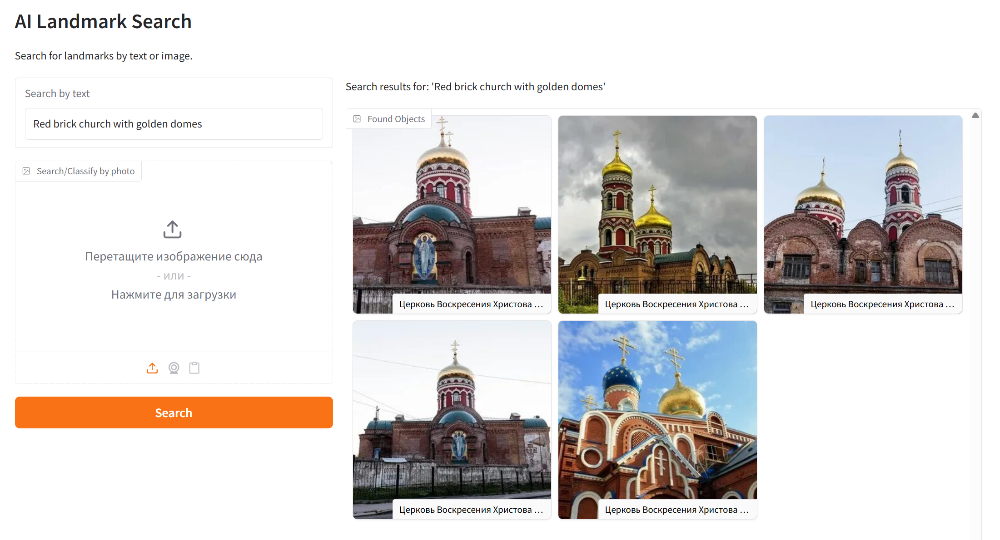
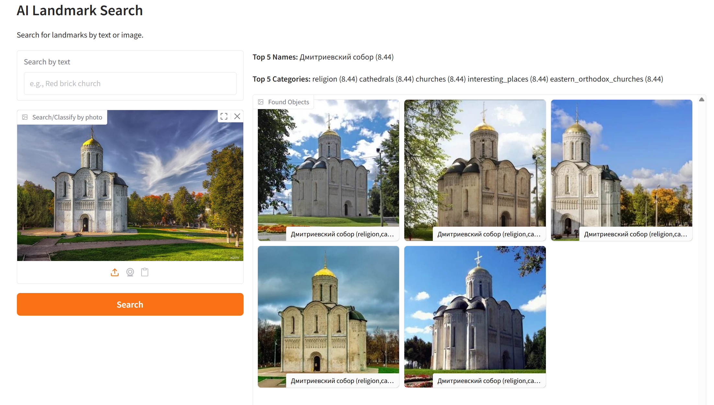

# AI Landmark Search & Classification

**Live Demo:** [http://82.22.184.98:7861/](http://82.22.184.98:7861/)

A powerful semantic search engine and image classifier for landmarks, powered by Google's **[SigLIP 2](https://huggingface.co/google/siglip2-so400m-patch14-384)** (Vision Transformer). This tool allows users to search for places using natural language text queries or by uploading an image to find similar locations and identify them.

> **Why SigLIP 2?** Unlike standard CLIP models (which rely on contrastive loss with large batch sizes for stability), SigLIP uses a sigmoid loss function. This makes the model's performance **independent of batch size**, allowing for stable and high-quality embeddings even when processing images one by one or in small batches on limited hardware. It also natively supports multilingual text, including Russian.

## Features

- **Semantic Text Search:** Find landmarks using natural language (e.g., *"Red brick church with golden domes"*). The model understands complex descriptions, architectural styles, and Russian text natively.

  
- **Image Search (Reverse Image Search):** Upload a photo to find similar landmarks in the database.

  
- **AI Classification:** Automatically identifies the **Top-5 most probable names** and **categories** for any uploaded landmark photo using a voting k-NN approach.
- **High Performance:**

  - Uses **[SigLIP 2 (So400m)](https://huggingface.co/google/siglip2-so400m-patch14-384)**.
  - Supports **GPU acceleration** (CUDA) and **CPU optimization** (Dynamic Quantization).
  - Vector search is performed using optimized matrix operations (NumPy).

---

## Quick Start (Docker)

### Option 1: Run Pre-built Image (Recommended)

Just create a `docker-compose.yml` file:

```yaml
services:
  landmark:
    image: 48glock/landmark:0.8
    restart: unless-stopped
    ports:
      - "7861:7861"
    environment:
      - PORT=7861
    healthcheck:
      test: ["CMD","curl","-f","http://localhost:7861/"]
      interval: 30s
      timeout: 3s
      retries: 3
```

Then run:

```bash
docker compose up -d
```

### Option 2: Build from Source

If you want to modify the code:

1. **Clone the repository**

   ```bash
   git clone https://github.com/48bebrikov/landmark-search.git
   cd landmark-search
   ```
2. **Run with Docker Compose**

   ```bash
   docker compose up -d --build
   ```

---

## Installation (Local Python)

If you prefer to run without Docker:

1. **Install Dependencies:**

   ```bash
   pip install -r requirements.txt
   ```
2. **Run the App:**

   ```bash
   python app.py
   ```

   Open `http://127.0.0.1:7860` in your browser.

---

## Project Structure

```text
.
├── app.py                 # Main Gradio application logic
├── create_embeddings.py   # Script to generate embeddings from images
├── Dockerfile             # Docker image configuration
├── docker-compose.yml     # Container orchestration setup
├── requirements.txt       # Python dependencies
├── dataset_indexed.csv    # Metadata (filenames, names, categories)
├── embeddings.npy         # Precomputed SigLIP 2 embeddings (1152-d)
└── images/                # Image dataset (not included in repo)
```

## How It Works

1. **Preprocessing:** Images are processed using `SigLIP 2` (Vision Transformer), which generates high-quality 1152-dimensional vector embeddings.
2. **Indexing:** All dataset images are pre-vectorized and stored in `embeddings.npy`.
3. **Search:**
   - **Text-to-Image:** The user's text query is converted to a vector. We calculate cosine similarity against all image vectors to find the best matches.
   - **Image-to-Image:** The uploaded image is vectorized, and the system finds the nearest neighbors in the vector space.
4. **Classification:** For the uploaded image, the system retrieves the Top-10 nearest neighbors and performs a weighted vote to predict the most likely Name and Category.

## Requirements

- Python 3.10+
- RAM: ~1GB (u can make swap for build)
- GPU (Optional)

## License

MIT License.
